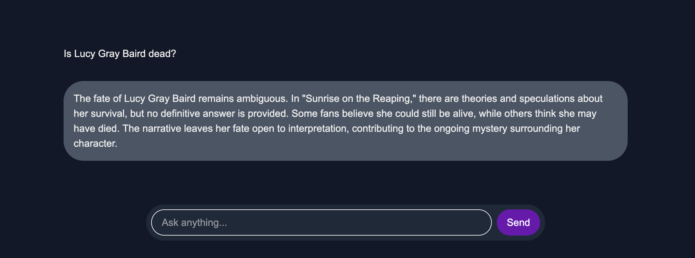

# Sunrise of the Reaping — AI Book Companion

A personalized AI chatbot built to deeply understand and discuss the book *Sunrise of the Reaping* (2025). My client was my girlfriend.

## 🧠 What It Does

Sunrise of the Reaping is a **Retrieval-Augmented Generation (RAG)** chatbot that:
- Answers detailed questions about *Sunrise of the Reaping*
- Provides character insights, and lore explanations
- Supports conversational queries and has accurate knowledge about the book.

## ✨ Tech Stack

| Layer         | Tooling/Service                                  |
|--------------|--------------------------------------------------|
| Frontend     | [React](https://reactjs.org/), [Next.js](https://nextjs.org/), TypeScript |
| Vector Store | [DataStax Astra DB](https://www.datastax.com/astra) (via Cassandra + vector search) |
| RAG Engine   | [LangChain](https://www.langchain.com/) for document chunking and query management |
| Embeddings   | [OpenAI](https://platform.openai.com/) for embeddings & completions |
| Deployment   | Vercel |

## 🖼️ Screenshots

